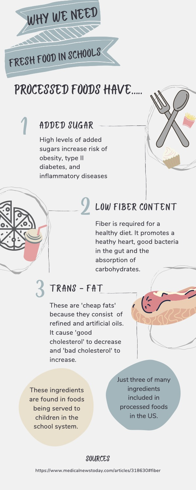

# Non-processed school lunch initiative
### _Learn healthy, eat healthy_

## Mission Statement
 From experience, we know the types of food being served during lunch time at Public schools across the country. These foods, although “up to the FDA standards” are poor in terms of quality although they are affordable. What we propose is for all public and or federally funded schools to serve organic, local, and unprocessed/ natural foods for their students. This will see a multitude of benefits for not only the students but also for the local economy. 
 
Explore our tabs for more details.
